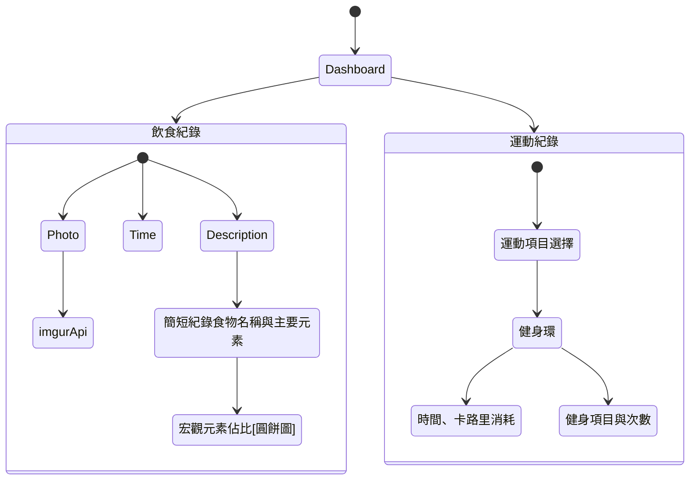

# Make Exercise a Habbit

### Describe
藉由對飲食與運動的紀錄來養成健身的習慣

### 飲食
1. 每日三餐照片
   > imgur api
2. 每餐的簡短紀錄
   > 食物名稱、該食物主要元素
3. 宏觀元素比例預估
   > 圓餅圖呈現

### 運動
1. 記錄每日運動量與項目
   > 運動項目分類，手臂、腰部、腹部、腿部...等

### Mermaid
Use https://mermaid.live

